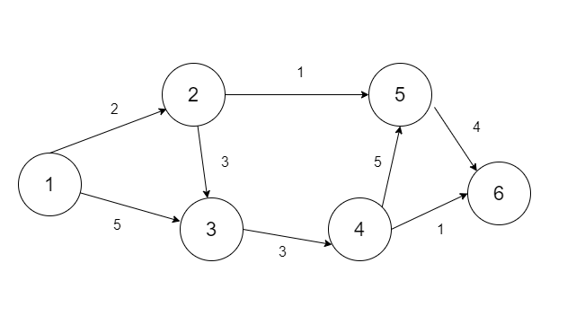

# Сетевая диограмма
### Задача
Построить сетевую диаграмму, оптимизировать по времени, максимальное количество человек которые можно использовать - 6

|Шифр работ|t, дни|Q, человек|
|----------|------|----------|
|1-2       |2     |2         |
|1-3       |5     |1         |
|2-3       |3     |6         |
|2-5       |1     |1         |
|3-4       |3     |2         |
|4-5       |5     |2         |
|4-6       |1     |3         |
|5-6       |4     |2         |

### Сетевая диаграмма

### Оптимизация по времени

Сумма работников в каждый день не превышает 6 человек.
